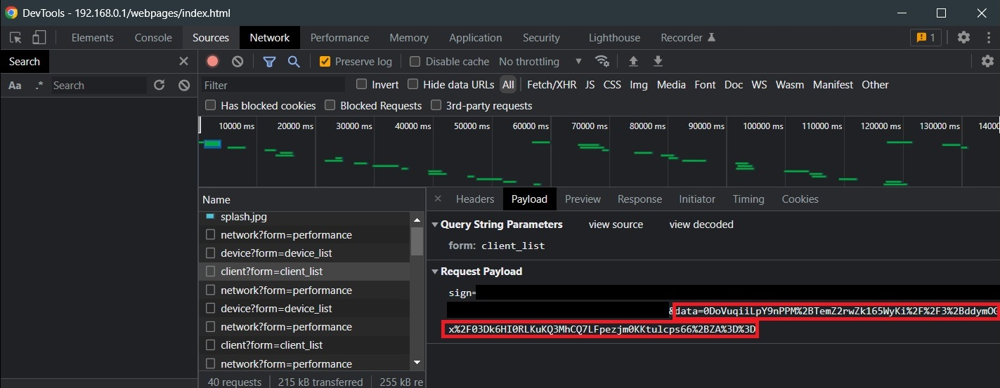

# Debugging

## General Steps

Check that:

1. TP-Link Deco integration is the latest published version
2. TP-Link Deco router firmware is up to date
3. Enable debug logging in `configuration.yaml` by adding these lines:

```yaml
logger:
  logs:
    custom_components.tplink_deco: debug
```

## Additional Debugging

If the debug logs show that a call is failing because of one of the following reasons:

- Error response from router
- Timed out

Follow the below steps to check that the router is behaving as expected.

1. Disable the TPLink Deco integration if it is enabled (If it is enabled it will keep logging you out)
2. Enable the browser developer console
3. Login to the admin UI page
4. Go to the page with the failing call (Example: Go to page that lists clients if the list clients call is failing)
5. Find the call that is failing in the developer console network tab.
   Call | Example URL
   ---|---
   Fetch Keys | http://192.168.0.1/cgi-bin/luci/;stok=/login?form=keys
   Fetch Auth | http://192.168.0.1/cgi-bin/luci/;stok=/login?form=auth
   Login | http://192.168.0.1/cgi-bin/luci/;stok=/login?form=login
   List Decos | http://192.168.0.1/cgi-bin/luci/;stok=0123456789abcdef/admin/device?form=device_list
   List Clients | http://192.168.0.1/cgi-bin/luci/;stok=0123456789abcdef/admin/client?form=client_list
6. Copy the request

   - If the request does NOT have `data=` param, then just copy the whole payload to the bug
   - If the request has a payload with `data=` param, then copy the part right after `data=`
     . Then in the developer console type the following code:

   ```js
   data = "<insert text after data= here>";
   jQuery.encrypt.encryptManager.encryptor.AesDecrypt(decodeURIComponent(data));
   ```

   Then copy the output to the bug.

7. If the call was successful but the parsing on the integration failed. Copy the response.
   - If the response does NOT have a `"data": ` key, then copy the whole response.
   - If the response has a `"data": ` key, then copy the text after that and decode it in the same way as step 6.
